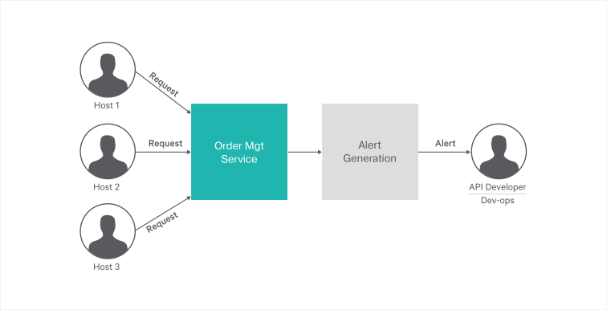

[](https://travis-ci.org/ballerina-guides/stream-processing)

Stream Processing
=================

Streaming processing is designed to process event streams in a streaming manner, detect complex event occurrences,
and send notifications in real-time.

Note: Ballerina Streaming capabilities are shipped as the experimental feature in the latest release. Please use `--experimental` flag when compiling Ballerina files which have streaming constructs.

>This guide provides an overview of the streaming capabilities of Ballerina and demonstrates how to build a
comprehensive streaming usecase using Ballerina stream processing.

The following sections are available in this guide.

* [What you'll build](#what-youll-build)
* [Prerequisites](#prerequisites)
* [Developing queries](#developing-queries)
* [Testing](#testing)
* [Deployment](#deployment)
* [Output](#output)


## What you'll build

To understand Ballerina stream processing better, let's take a real world usecase and implement that using Ballerina stream processing features.

Let's assume, that you are a API developer and you have published a few APIs to the API store. There are also subscribers who
have subscribed to these APIs. 

In this scenario, an order management system allows you to add orders. You also need to build an alert generation 
mechanism that sends you an alert if the number of API/service requests from an API exceeds ten within a time period of ten seconds.



## Prerequisites

Before you begin, make sure that the following applications are installed:
 
- JDK 1.8 or later
- [Ballerina Distribution](https://github.com/ballerina-lang/ballerina/blob/master/docs/quick-tour.md)
- A Text Editor or an IDE 

### Optional requirements
- Ballerina IDE plugins ([IntelliJ IDEA](https://plugins.jetbrains.com/plugin/9520-ballerina), [VSCode](https://marketplace.visualstudio.com/items?itemName=WSO2.Ballerina), [Atom](https://atom.io/packages/language-ballerina))
- [Docker](https://docs.docker.com/engine/installation/)


## Developing queries

> If you want to skip the basics, you can download the git repository and directly move to the [Testing](#testing) section without following the [Developing queries](#developing-queries) section.

### Create the project structure

Ballerina is a complete programming language that supports any custom project structure. In this scenario, let's use the following module structure for this project to follow 
this guide.

```
streaming-service
  └── api-alerting
      ├── order_mgt_service.bal
      ├── api_alert.bal
      └── test
          └── order_mgt_service_test.bal          
```
You can create the above Ballerina project via the Ballerina project initializing toolkit.

- First, create a new directory named `streaming-service` in your local machine. Then navigate to this directory in the terminal. 
- Enter the following inputs to the Ballerina project initializing toolkit.
```bash
streaming-service$ ballerina init -i
Create Ballerina.toml [yes/y, no/n]: (y) y
Organization name: (lahiru) api_alerting
Version: (0.0.1) 
Ballerina source [service/s, main/m, finish/f]: (s) s
Module for the service: (no module) api_alerting
Ballerina source [service/s, main/m, finish/f]: (f) f

Ballerina project initialized
```

- Once you initialize your Ballerina project, you can change/add the names of the file to match our guide project file 
names.

### Implement the streaming queries

- Let's write streaming query as mentioned below. The forever statement contains the streaming queries that are relevant for this
usecase/scenario.

##### api_alert.bal
```ballerina

import ballerina/io;

type ClientRequest record {
    string host;
};

type RequestCount record {
    string host;
    int count;
};

stream<ClientRequest> requestStream = new;

function initRealtimeRequestCounter () {

    stream<RequestCount> requestCountStream = new;

    //Whenever the `requestCountStream` stream receives an event from the streaming rules defined in the `forever` block,
    //the `alertRequestCount` function is invoked.
    requestCountStream.subscribe(alertRequestCount);

    //Gather all the events that are coming to requestStream for ten seconds, group them by the host, count the number
    //of requests per host, and check if the count is more than 10. If yes, publish the output (host and the count) to
    //the `requestCountStream` stream as an alert. This `forever` block is executed once, when initializing the service.
    // The processing happens asynchronously each time the `requestStream` receives an event.
    forever {
        from requestStream
        window time(10000)
        select host, count(host) as count
        group by host
        having count > 10
        => (RequestCount [] counts) {
                //The 'counts' is the output of the streaming rules and is published to the `requestCountStream`.
                //The `select` clause should match the structure of the 'RequestCount' struct.
            foreach var requestCount in counts {
                requestCountStream.publish(requestCount);
            }
        }
    }
}

// Define the `alertRequestCount` function.
function alertRequestCount (RequestCount reqCount) {
    io:println("ALERT!! : Received more than 10 requests within 10 seconds from the host: ", reqCount.host);
}

```

- Let's get started with a Ballerina service named `order_mgt_service`, which is the RESTful service that serves the order 
management request. `order_mgt_service` can have multiple resources. Each resource is dedicated for a specific order 
management functionality. 

- You can add the content to your Ballerina service as shown below. In that code segment, you can find the implementation 
of the `order_mgt_service` service.
 
For each order management operation, there is a dedicated resource. Inside each resource, you can implement the 
order management operation logic. Here, the `order_mgt_service.bal` file that is used in the restful-service guide 
explains how streaming queries can be used with a modification that calls a function to send an event to the 
stream.

##### order_mgt_service.bal
```ballerina

import ballerina/http;

function sendRequestEventToStream (string hostName) {
    ClientRequest clientRequest = {host : hostName};
    requestStream.publish(clientRequest);
}

listener http:Listener ep = new (9090);

// Order management is done using an in memory map.
// Add some sample orders to 'ordersMap' at startup.
map<json> ordersMap = {};

// RESTful service.
@http:ServiceConfig { basePath: "/ordermgt" }
service orderMgt on ep {

    future<()> ftr = start initRealtimeRequestCounter();

    // Resource that handles the HTTP POST requests that are directed to the path
    // '/orders' to create a new Order.
    @http:ResourceConfig {
        methods: ["POST"],
        path: "/order"
    }
    resource function addOrder(http:Caller con, http:Request req) {

        string hostName = untaint con.remoteAddress.host;
        sendRequestEventToStream(hostName);

        json orderReq = <json> req.getJsonPayload();
        string orderId = orderReq.Order.ID.toString();
        ordersMap[orderId] = orderReq;

        // Create response message.
        json payload = { status: "Order Created.", orderId: untaint orderId };
        http:Response response = new;
        response.setJsonPayload(payload);

        // Set 201 Created status code in the response message.
        response.statusCode = 201;
        // Set 'Location' header in the response message.
        // This can be used by the client to locate the newly added order.
        response.setHeader("Location", "http://localhost:9090/ordermgt/order/" +
                orderId);

        // Send response to the client.
        _ = con->respond(response);
    }
}

```

- With that we've completed the development of the order_mgt_service and api_alert implementation. 

### Customize the streaming queries to send email alerts

In the above implementation, you generate a log to the stdout. An extended version of the above implementation sends 
the alert as an email. The following demonstrates how to configure the gmail connector to send email as alerts.

- Add the following code fragment to the `api_alert.bal` file as a global variable (in the same scope the `ClientRequest` and `RequestCount` types are defined).
Remember to import the gmail connector.
For more information about how the Ballerina gmail connector is configured, click [here](https://github.com/wso2-ballerina/package-gmail/blob/master/Readme.md).
You need to replace the values for `access-token`, `client-id`, `client-secret`, and `refresh-token` with your OAuth credentials.
For more information abount Google OAuth 2.0 applications, click [here](https://developers.google.com/identity/protocols/OAuth2).

```ballerina
//import gmail connector at the top of the file.
import wso2/gmail;


endpoint gmail:Client gMailEP {
    clientConfig:{
        auth:{
            accessToken:"access-token",
            clientId:"client-id",
            clientSecret:"client-secret",
            refreshToken:"refresh-token"
        }
    }
};
```

- Replace the function body of `alertRequestCount` with the following code fragment. Then the program sends an email alert to the respective recipient instead of printing a log.
You also need to replace the `recipient@mail.com` and `sender@mail.com` with the correct recipient and sender email addresses.

```ballerina
gmail:MessageRequest messageRequest;
messageRequest.recipient = "recipient@mail.com";
messageRequest.sender = "sender@mail.com";
messageRequest.subject = "Too many orders!!";
messageRequest.messageBody = "Received more than 10 requests from the host within 10 seconds: " + reqCount.host;
//Set the content type of the mail as TEXT_PLAIN or TEXT_HTML.
messageRequest.contentType = gmail:TEXT_PLAIN;

//Call the GMail endpoint function sendMessage().
var sendMessageResponse = gMailEP -> sendMessage("me", messageRequest);
match sendMessageResponse {
    (string, string) sendStatus => {
        //For a successful message request, returns message and thread id.
        string messageId;
        string threadId;
        (messageId, threadId) = sendStatus;
        io:println("Sent Message Id : " + messageId);
        io:println("Sent Thread Id : " + threadId);
    }
    gmail:GmailError e => io:println(e); //For unsuccessful attempts, returns GMail Error.
}
```

## Testing

As mentioned in the previous steps, you need to invoke the order management service you developed to get the alerts generated 
from streaming queries. Ten or more requests need to be sent from the same host within 10 seconds to generate an alert.


### Invoking the service 

The service you developed above can be run in your local environment. To run it, open your terminal, navigate to the
`<SAMPLE_ROOT_DIRECTORY>/streaming-service` directory and execute the following command.

```
$ ballerina run --experimental api-alerting
```
NOTE: You need to have the Ballerina installed in you local machine to run the Ballerina service.  

You can test the functionality of the order management service by sending more than ten
HTTP requests to the `order` operation within ten seconds.
e.g., The following cURL commands are used to test the `order` operation as follows.
For an alert to be generated, the `order` operation should be invoked more than
ten times within a time period of ten seconds from the same host.

**Create Order** 
```
curl -v -X POST -d \
'{ "Order": { "ID": "100500", "Name": "XYZ", "Description": "Sample order."}}' \
"http://localhost:9090/ordermgt/order" -H "Content-Type:application/json"

Output :  
< HTTP/1.1 201 Created
< Content-Type: application/json
< Location: http://localhost:9090/ordermgt/order/100500
< Transfer-Encoding: chunked
< Server: wso2-http-transport

{"status":"Order Created.","orderId":"100500"} 
```

### Writing unit tests

In Ballerina, the unit test cases should be in the same module inside a folder named `tests`.  When writing the test functions the below convention should be followed.
- Test functions should be annotated with `@test:Config`. See the below example.
```ballerina
   @test:Config
   function testOrderAlerts() {
```

This guide contains  an unit test case for alert generation available in the 'order_mgt_service' implemented above.

To run the unit tests, open your terminal and navigate to `<SAMPLE_ROOT_DIRECTORY>/streaming-service`, and run the following command.
```bash
$ ballerina test --experimental
```

To check the implementation of the test file, refer to the [order_mgt_service_test.bal](https://github.com/ballerina-guides/stream-processing/blob/master/streaming-service/api-alerting/tests/order_mgt_service_test.bal).

## Deployment

Once the development of the service is complete, you can deploy the service by following any of the methods that are listed below. 

### Deploying locally

- First, build a Ballerina executable archive (.balx) of the service that you developed by navigating to the `<SAMPLE_ROOT>/api-alerting/` 
directory and issuing the command given below. This command points to the directory in which the service is located, and creates an executable binary out of that. 

```
$ ballerina build --experimental api-alerting
```

- Once the `api-alerting.balx` is created inside the target directory, you can run it by issuing the following command. 

```
$ ballerina run target/api-alerting.balx
```

- Once the service is successfully executed, the following output is displayed. 
```
$ ballerina run target/api-alerting.balx 

Initiating service(s) in 'target/api-alerting.balx'
[ballerina/http] started HTTP/WS endpoint 0.0.0.0:9090
```

### Deploying on Docker

You can run the service developed above as a docker container. The Ballerina platform offers native support to
run Ballerina programs on containers. Therefore, you only need to add the corresponding docker annotations to your service code. 

### Deploying on Kubernetes

- The service you developed can be run on Kubernetes. The Ballerina language offers native support to 
run Ballerina programs on Kubernetes by using Kubernetes annotations that you can include as a part of 
your service code. This also creates the required docker images. Therefore you do not need to explicitly create 
docker images before deploying the service on Kubernetes. 

For information about more deployment options, click [here](https://github.com/ballerina-guides/restful-service#deployment).
## Output
If one or more of the criteria for the alert is satisfied, the following output is displayed when the service is invoked.

```
ALERT!! : Received more than 10 requests from the host within 10 seconds: localhost:9090

```
